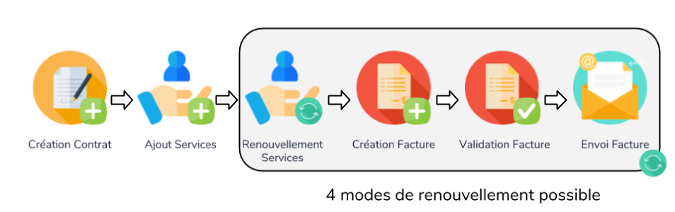

---

# Description

---

* Le module Contrat Plus modifie les usages du module Contrat de DOLIBARR. Pour cela, il va ajouter plusieurs champs complémentaires aux services afin d’expliciter les usages.

* Il ajoute 3 champs complémentaires sur les services :
    * La date de mise en service
    * La durée d’engagement du service
    * Date de fin d'engagement
    
* Ce module a été développé afin de faciliter la gestion du suivi des contrats et des services associés

---

# Contrat et services 

---

### Les usages classiques

* Les usages liés aux contrats et services associés se déroulent en 7 étapes manuelles: 
    
    * 1 - Création du contrat
    * 2 - Ajout de(s) service(s)
    * 3 - Renouvellement individuel de chaque(s) service(s)
    * 4 - Création de la facture associée au contrat
    * 5 - Validation de la facture
    * 6 - Envoi de la facture par mail


### Les avantages de Contrat Plus

* Contrat Plus propose d'automatiser les étapes 3, 4, 5 et 6



---

# Les usages

---

### 2 méthodes & 4 modes de renouvellement

####  Les 2 méthodes

* Vous pouvez choisir entre 2 méthodes :

    * 1 - INDIVIDUELLEMENT via le bouton ‘Renouveler Plus’ présent sur la page du contrat

    ##### OU 

    * 2 - GLOBAL en selectionant les contrats souhaités via la page 'Contrat - Liste Plus’ et le bouton 'Renouveler le(s) contrat(s) sélectionné(s)’

####  Les 4 modes

* Il faut choisir l’un des 4 modes pour faire le renouvellement :

    * 0 - Renouvellement simple des services
    * 1 - Renouvellement des services et création d'une facture brouillon
    * 2 - Renouvellement des services, création et validation de la facture
    * 3 - Renouvellement des services, création, validation et envoi par mail de la facture
    
* avec le mode 3, deux nouveaux onglets sont disponibles dans la configuration :

    * 'Configuration email' qui permettra de configurer l'objet et le core du mail à envoyer
    * 'Historique email' qui permettra de voir l'historique des derniers mails partis

### Cas d'usage

#### Ceci est un exemple d'utilisation
 
 * Une fois le module activé, il faut le configurer via 'Accueil > Modules > Contrat Plus configuration' ou via 'Contrat Plus > Configuration'
 
    * 1 - il faut configurer le mode de renouvellement
 
    * 2 - il faut définir les champs obligatoires :
     
        * Date de début du service
        * Date de fin du service
        * Date de création de la facture

#### Facultatif   
 * 3 - Les autres options sont facultatives mais nous vous conseillons de définir un modèle PDF pour les factures.
 
 * 4 - N'oubliez pas d'activer l'option fournisseur si cette fonctionnalité vous intéresse. (Un champs de configuration modèle PDF fournisseur apparaitra)
 
 * 5 - Enfin, si vous avez selectionné le mode 3 (Envoi de mail), il faudra configurer l'envoi de mail dans l'onglet "Configuration Email" :
 
    * Sélectionner un template d'email
    
    ##### OU
     
    * Définir le champ objet de l'email
    * Définir le champ contenu de l'email

#### La configuraiton est terminée

 * Les 2 méthodes de renouvellement sont disponibles
 
### Renouvellement automatisé

Depuis la version 2.5.0 du module, Contrat Plus propose le renouvellement automatique des contrats à une date en utilisant les travaux planifiés (CRON).

Afin de pouvoir utiliser cette fonctionnalité, il faudra d'abbord effectuer quelques étapes de configuration : 

* Activer le module 'Travaux planifiés' de dolibarr via Accueil > Configuration > Modules et le configurer.

* Activer le cron Contrat Plus via Contrat Plus > Configuration > Configuration renouvellement automatisé

* Définir la prochaine date et heure pour le renouvellement automatisé (Il pourra y avoir un décallage de 5 minutes dû au cron système).

* Le renouvellement automatique est maintenant configuré et il s'effectuera à chaque date défini dans la configuration 

Le renouvellement automatisé n'est pas supporté pour les versions de Dolibarr antèrieur à 6.0. C'est pour cela que sur un Dolibarr infèrieur à 6.0, il n'y a aucune mention de renouvellement automatisé.
    

---
 
# Important
 
---
 
 * Il n'est pas possible de mixer les durées de services différentes au sein d’un même contrat
 
 * Le renouvellement automatisé n'est pas supporté pour les versions de Dolibarr antèrieur à 6.0. C'est pour cela que sur un Dolibarr infèrieur à 6.0, il n'y a aucune mention de renouvellement automatisé.
 
 * Ne pas oublier de configurer les droits Contrat Plus pour les utilisateurs via Acceuil > Utilisateurs > Permissions.
   
---

# Compléments

---

* Dans le module facturation, bien vérifier qu'il y ait un modèle de facturation d'activé

* Dans la version 2.3.1 du module, il est possible gérer les contrats fournisseurs 
    * Pour cela, il faut l’activer dans le menu configuration du module. Pensez à activer un modèle de facture fournisseur :exclamation: ,
    * Ensuite, dans le contrat, une case à cocher apparaît et elle indique si le contrat est client OU fournisseur (client par défaut).
    * Attention, la liste des services des contrats fournisseurs ne sera pas affichée lorsque la gestion des contrats fournisseurs est décochée dans la configuraion du module.
  
* Un modèle de facture PDF additionnel basé sur le modèle 'crabe' affiche les 3 champs complémentaires au sein de la facture. Ce modèle PDF est disponible pour les factures clients et fournisseurs (ne pas oublier de les activer)

* Pour l'envoi de mail :
    * Un indicateur visuel sur le listing des contrats est présent pour indiquer si un mail peut être envoyé au tiers
    * Si le tiers ne possède pas de mail ou de contact, le bouton renouveler plus sera désactivé et le contrat ne sera pas sélectionnable pour un renouvellement massif
    * L'indicateur de mail n'est pas visible en option 0, 1 ou 2
    
* Dans la version 2.5.0 du module, il est possible de clôturer un contrat. Un contrat clôturé ne sera pas visible sur le listing des contrats de contrat plus. Ce status pourra être filtré sur ce même listing.
    * Un contrat avec des services actifs ne peux pas être cloturé. Il faut penser à clôture tous les services avant de clôturer un contrat.
 
---

# Informations techniques

---

Voici les détails techniques du module

### Extrafields
* Le module ajoute un certain nombre d'extrafields à supprimer à la main si vous voulez désinstaller le module

    * Contrat (supplier_contract | contratplus_bank | contratplus_automated | contratplus_closed)
    * Contrat ligne (serv_date_start | serv_duree | serv_date_end)
    * Facture ligne (serv_date_start | serv_duree | serv_date_end)
    * Fournisseur facture ligne (serv_date_start | serv_duree | serv_date_end)
    * Commande ligne (serv_duree)
    * Proposition commerciale ligne (serv_duree)
    
### Variables de substitution
* Le module ajoute des variables de substitution sur la référence et les notes publiques et privées d'un contrat

    * __ C_D__ : Alias de __ DAY_TEXT__ qui permet d'afficher le jour en format texte (Ex: Lundi)
    * __ C_M__ : Alias de __ MONTH_TEXT__ qui permet d'afficher le mois en format texte (Ex: Janvier)
    * __ C_Y__ : Alias de __ YEAR __ qui permet d'afficher l'année en format numérique (Ex: 2020)
    * __ CURRENT_WEEK__ & __ C_W__ : Permet d'afficher le numéro de la semaine (Ex: Semaine 02)
    * __ CURRENT_QUARTER & __ C_Q__ : Permet d'afficher le numéro du trimestre (Ex: Trimestre 1)
    * __ CURRENT_HALF & __ C_H__ : Permet d'afficher le numéro du semestre (Ex: Semestre 2)

### Configuration
* En MAIN_FEATURE_LEVEL 3, 2 boutons sont disponibles sur la page de configuration

    * Générer les dates de fin d'engagement : Génère les dates de fin d'engagement pour chaque service avec une durée d'engagement et sans date de fin d'engagement
    * Supprimer les dates de fin d'engagement : Supprime toutes les dates de fin d'engagement
    
* Attention, il faut désactiver le mode strict de mysql pour ne pas avoir d'erreur sur le listing des contrats (Problème avec le mode ONLY_FULL_GROUP_BY)

### Module certifié selon les critères suivants
* Dolibarr 3.9 / 9.x

* Compatible PHP 5.x / PHP 7.x

* Le code source est validé selon les critères DOLIBARR (Branches master & developement)

* Gestion des ACLs DOLIBARR

* Traduction du contenu en FR / US / (ES à venir)

* Fourniture d'une documentation utilisateur / administrateur

### Bug Dolibarr

* Sur les factures fournisseurs, les dates de début et de fin de service ne sont pas présentes.

  Nous avons remarqué ce bug de dolibarr qui nécessite une modification du core mais nous avons décider de ne pas modifier le core dans notre module.

  Ce bug n'est pas bloquant pour le fonctionnement du module.

  Nous fournissons les modifications à effectuer sur le core mais nous ne sommes pas responsable d'une erreur lors de cette modification.
  C'est pour cela que nous vous conseillons de sauvegarder le fichier avant d'effectuer cette modification.

  Le fichier concerné est **fourn/class/fournisseur.facture.class.php**

  #### fourn/class/fournisseur.facture.class.php
  ```php
  // 9 ajouts
  class FactureFournisseur
  {
      function create()
      {
          // dans l'appel de fonction ajouter 4 arguments
          $this->updateline(
              ...,
              '', // ++
              '', // ++
              $this->lines[$i]->date_start, // ++
              $this->lines[$i]->date_end // ++
              );
      }
  
      function fetch_lines()
      {
          // dans l'affectation de $sql
          $sql .= ', f.date_start, f.date_end'; // ++
  
          // dans l'affectation des variables de $line
          $line->date_start     = $obj->date_start; // ++
          $line->date_end       = $obj->date_end; // ++
      }
  
      function updateline()
      {
          // dans l'affectation des variables de $line
          $line->date_start     = $date_start; // ++
          $line->date_end       = $date_end; // ++
      }
  }

  // 7 ajouts
  class SupplierInvoiceLine
  {
      // ajouter 2 attributs
      public $date_start; // ++
      public $date_end; // ++
  
      function fetch()
      {
          // dans l'affectation de $sql
          $sql.= ', f.date_start, f.date_end'; // ++
  
          // dans l'affectation des variables de l'objet
          $this->date_start     = $obj->date_start; // ++
          $this->date_end       = $obj->date_end; // ++
      }
  
      function update()
      {
          // dans l'affectation de $sql
          $sql.= ", date_start = '" . date('Y-m-d H:i:s', $this->date_start) . "'"; // ++
          $sql.= ", date_end = '" . date('Y-m-d H:i:s', $this->date_end) . "'"; // ++
      }
  }
  ```

* Sur Dolibarr 7 et antérieur, sur l'onglet services client du dashboard, un warning apparait concernant une division par 0 si un C.A est égale à 0.
  Ceci est bug core de Dolibarr qui a été corrigé dans les versions supérieures

### Mentions
Icon made by [Freepik](https://www.flaticon.com/authors/freepik) from www.flaticon.com

Icon made by [Cursor Creative](https://www.flaticon.com/authors/cursor-creative) from www.flaticon.com

Icon made by [Vectors Market](https://www.flaticon.com/authors/vectors-market) from www.flaticon.com

Icon made by [Icon Pond](https://www.flaticon.com/authors/popcorns-arts) from www.flaticon.com

Icon made by [Smashicons](https://www.flaticon.com/authors/smashicons) from www.flaticon.con

Icon made by [Roundicons](https://www.flaticon.com/authors/roundicons) from www.flaticon.con

Icon made by [Gregor Cresnar](https://www.flaticon.com/authors/gregor-cresnar) from www.flaticon.con