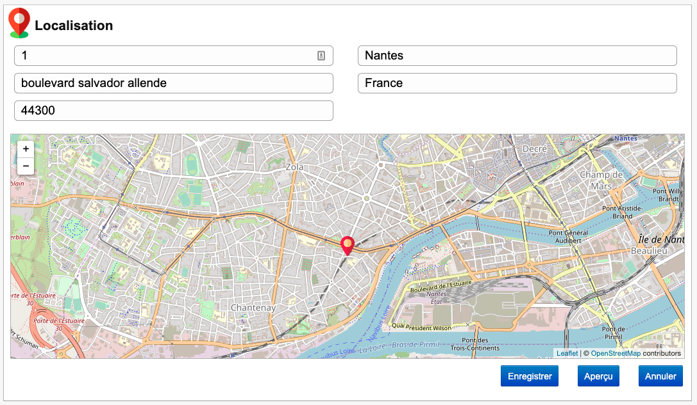
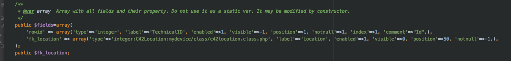
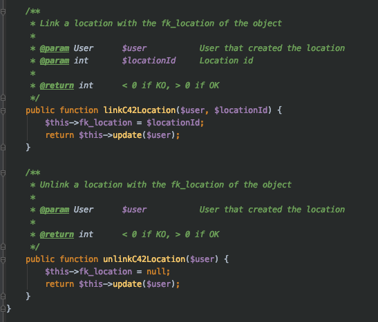
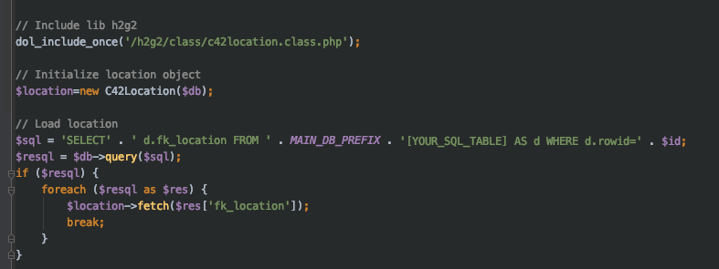
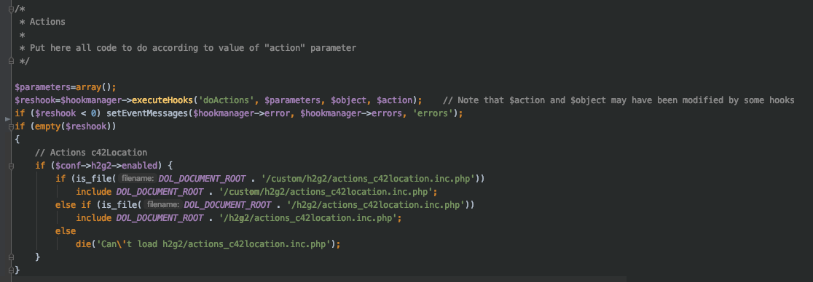
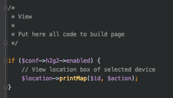
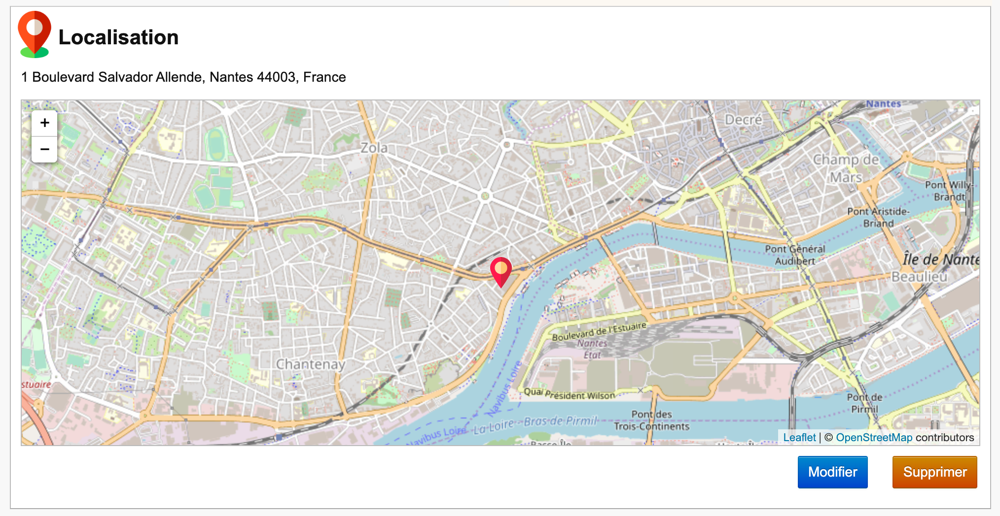
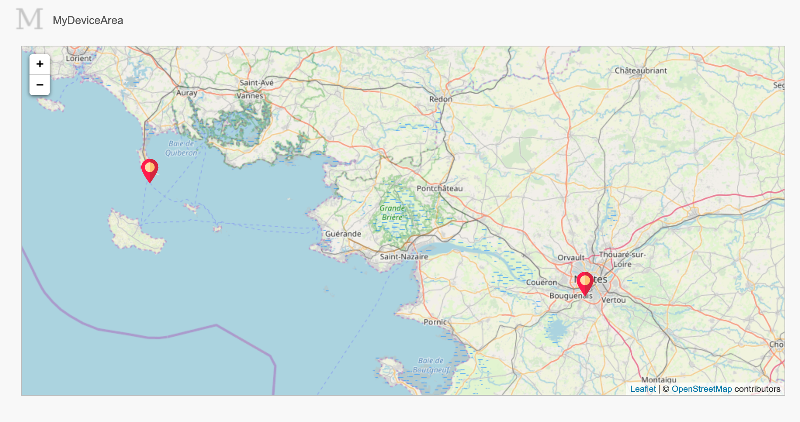
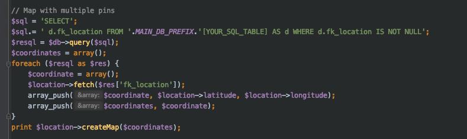
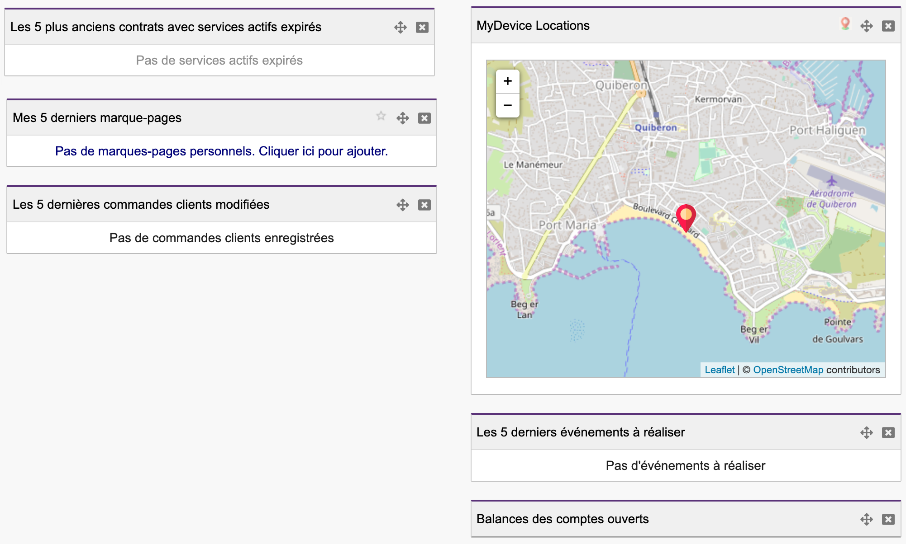

 

# Sommaire

---

### [1. Decriptif de la localisation](#utilisationLocation)

### [2. Intégration de la localisation](#integrationLocation)

### [3. Idées](#idees)

 

## Utilisation de la localisation 

---

H2G2 permet d'ajouter un système de localisation pour un objet en intégrant :

* [Leaflet](https://leafletjs.com/), une librairie permettant la manipulation d'une map OpenStreetMap
* [Nominatim](https://nominatim.openstreetmap.org/), une api permettant de récupérer une longitude et un latitude en fonction d'une adresse
* Une table c42location permettant de stocker des informations concernant l'adresse complète (numéro, adresse, code postal, ville, pays), une longitude et une latitude
* Une classe C42Location qui permet la manipulation de la localisation pour un objet

Grâce à ce système de localisation, vous pourrez géolocaliser votre objet sur une map en renseignant une adresse complète.

 

## Intégration de la localisation 

---

Pour intégrer la fenêtre Localisation à votre module procédé comme suit :

1) Ajouter un champ 'fk_location' à votre objet en base de données SQL ainsi que dans votre classe PHP.
 

 

2) Toujour dans votre classe, ajouter les fonctions 'linkC42Location' et 'unlinkC42location' qui permettront de lier et délier une location à votre objet. 
 

3) Dans votre page, inclure la class C42Location de la librairie H2G2 et initialiser un objet C42localisation.
 

4) Inclure les actions C42location à vos Actions.
 

5) Appeler la fonction 'printMap' de la classe C42location dans votre View.
 

6) Enjoy !
 

 

## Idées 

---

La classe C42Location de la librairie H2G2 vous fournit une fonction 'createMap()' vous permettant de créer votre propre map avec des pins sur les coordonnées que vous passez en paramètres via un tableau.
Ainsi vous pouvez par exmple :

* Afficher une map simple avec la localisation de tous vos objets.
 

 

* Ajouter un widget à votre tableau de bord.
 

